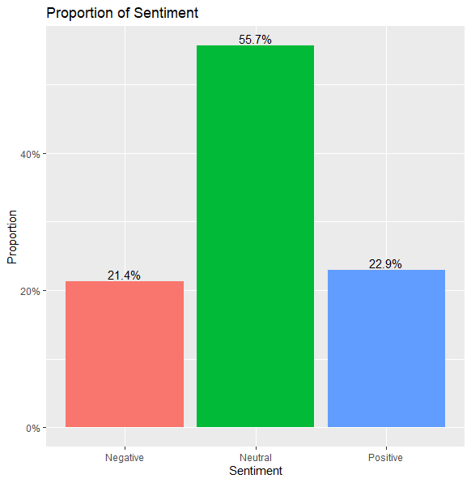
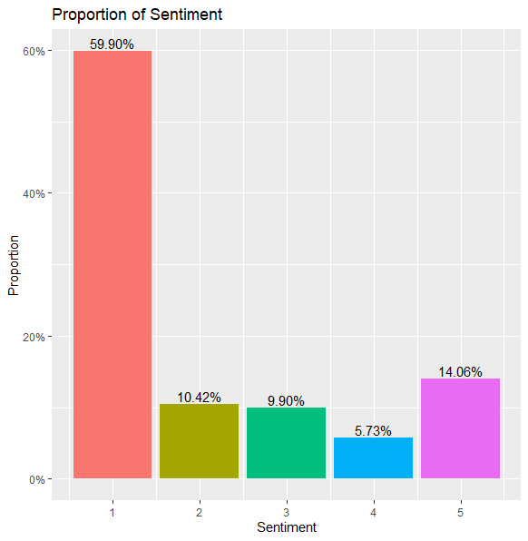

```{r setup, include=FALSE}
knitr::opts_chunk$set(echo = FALSE, warning = FALSE, message = FALSE)
library(tidyverse)
library(knitr)
setwd(dirname(rstudioapi::getSourceEditorContext()$path))
'This is a markdown file for Bixi Project Deliverable 1 for the purposes of data visualization and report generation. With the loaded libraries anyone should be able to run this file and generate the report. This was was written in R-4.2.1'

```

## Introduction

Sentiment analysis is a natural language processing approach used to identify the emotional tone behind a body of text. It is utilized by organizations to categorize opinions about a product, service or idea. Generally, these tools analyze text data from online sources such as product reviews, blog posts and forum comments to determine whether customers liked or disliked a product. 

For my Brainstation Capstone Project, I created sentiment models to identify the emotional tone of Reddit comments. Video game companies such as Valve and Riot constantly release new balance/patch notes for their online competitive video games which are often discussed in their communities' subreddits. Sentiment models can be used here to identify the community's overall reaction to these gameplay changes in order to build a better player experience which would in turn generate more revenue. 


## Dataset - GoEmotions

The NLP research community has made several open source datasets for the purposes of emotion/sentiment classification. However, they were relatively small and only focused on 6 main emotions. A Google Research team created a large-scale dataset (GoEmotions) that covered a more extensive set of emotions with the hopes that it could be used for a broader scope of future potential applications.

GoEmotions is a dataset of 58k unique Reddit comments extracted from popular English-language subreddits and labeled with 27 emotional categories. The dataset was created from Reddit comments from 2005 to 2019. Curation measures were applied to remove internet bias of extensive offensive language and to limit each comment length to 3-30 tokens. Each comment was scored for emotions by multiple reviewers who were native English speakers from India. 


```{r GoEmo27, fig.align = 'center', out.width="600px", fig.cap = '27 Emotion categories in the dataset, bucketed by sentiment'}
url <- "https://blogger.googleusercontent.com/img/a/AVvXsEigu_MmQ7zbqciHaEAl_rjZYNEPX6GyGEh9nkIoGOaMUg3BPCizBGJc-FhAMluHZHVX2cArth_0RgQVaEELUT3Y4oWv3V1h_ES5YjNxXJPre5YZy_2bG7ihLKjKOrQJTjEM-9SFLTFq6-Beo94ZS7yqslE-VFOH4xRlUX35rBVYtPskYGIv4DbBRiL08Q=s1213"
knitr::include_graphics(url)

```

## Wrangling
The raw dataset contains 211k observations and 58k unique comments. Each observation is a comment that is annotated for emotion(s) from a reviewer. The emotional scoring for each unique comment was aggregated and turned into a binary variable. The emotional scoring was only kept if multiple reviewers agreed upon the scoring. For example, if the emotional scoring for ‘admiration’ became a value of ‘2’ after aggregation, it was binarized to a value of ‘1’. This means that two reviewers needed to agree upon the emotion for it to have a value of  ‘1’. Afterwards, the comments were given a sentiment (positive/negative/ambiguous) based on the emotional binarizing (a comment with a value of ‘1’ for ‘Joy’ would have a positive sentiment). 

The final dataset was designed to have no overlap in sentiment. Comments with conflicting sentiments (positive and negative) were dropped from the dataset. Comments with a combinational sentiment of positive/negative and ambiguous were turned into positive or negative with the ambiguous sentiment being removed. For the purposes of sentiment analysis, comments scored for ambiguity were dropped from the dataset. The final dataset used for multiclass classification of sentiment contains 51,683 unique comments. 


```{r Flowchart, fig.align = 'center', out.width="600px", fig.cap = 'Data Wrangling Flowchart'}
flowchart <- "data_wrangling_flowchart.png"

knitr::include_graphics(flowchart)

```

## Results

The balance of the target variable (Sentiment) for the final dataset was 40% positive, 38% Neutral, and 22% Negative. Classification models (Logistic Regression, KNN, Decision Tree, SVM) were trained on 75% of the final dataset leaving 25% as the testing set. Comment text was vectorized using a bag-of-words model. Model hyperparameters were optimized using gridsearch with a cross validation of 5. The Logistic Regression Model performed the best based on F1-scores and had an overall accuracy of 68% on the testing data. 


| Logistic_Regression | Precision | Recall | F1-Score |
|:-------------------:|:---------:|:------:|:--------:|
|       Positive      |    0.80   |  0.72  |   0.76   |
|       Neutral       |    0.60   |  0.76  |   0.67   |
|       Negative      |    0.67   |  0.48  |   0.56   |

## Insights
To gain insight into how the model performs on real life data, the trained models were used to predict the overall sentiment of scraped Reddit comments. The sentiment prediction of each model can be found on a hosted Shiny dashboard here. Additionally, a pre-trained BERT model was used to predict the sentiment of the same data to compare model performance.

From the results of the dashboard, we observed that the models created using the GoEmotions dataset did not take into account the context into how a word was used. For example, the logistic regression model would predict a comment to always be positive if it encountered the acronym ‘lol’

```{r logbert, figures-side, fig.show="hold", out.width="50%", fig.cap = 'Sentiment Prediction (Left = Logistic Regression, Right = pre-trained BERT from Hugging Face)'}



```

## Summary

- model does not perform well for sarcasm, this is a generally problem for a lot of online conversational text
- does not perform as well as a pre-trained model, probably trained on a lot more data
- next steps, probably just use a pre-trained model

